# Visual Hooks

**English** · [Español](README.es.md)

<p align="center">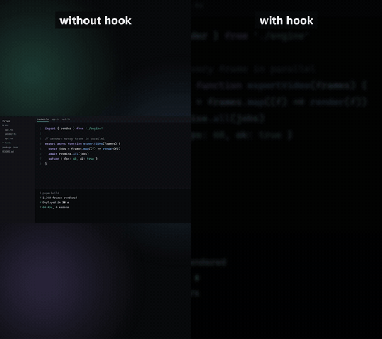</p>

**Scroll-stopping first seconds for TikTok, Reels and Shorts.** 26 animated hooks and effects plus auto-captions,
applied to your own video in a local app, exported as MP4, ProRes 4444 with alpha, or a PNG sequence. Free and open source,
and you can [make your own effects as mods](docs/mods.md).

```bash
git clone https://github.com/aetheride25-design/visual_hooks.git && cd visual_hooks
pnpm install
pnpm dev
```

Then open http://localhost:3210.

Made by [@chitodev](https://x.com/chitodev) · Built with [Remotion](https://www.remotion.dev)

## The hooks

| | | |
|---|---|---|
| 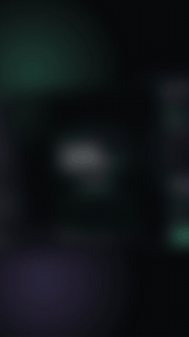<br>`focus-snap`: starts zoomed in and blurry, snaps into focus | 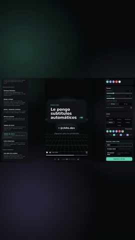<br>`punch-zoom`: hard zoom onto the result, with shake | 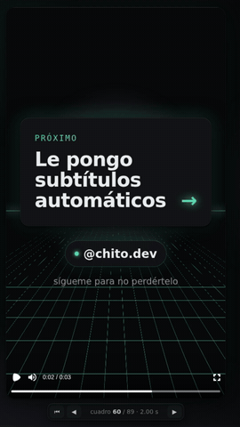<br>`text-drop`: heavy words that slam in |
| 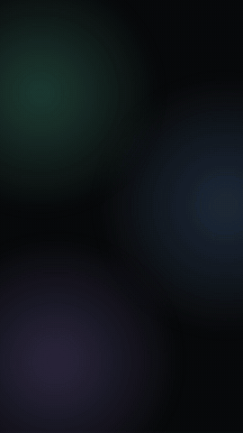<br>`window-3d`: your app pops out in perspective | 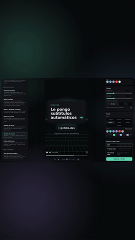<br>`arrow-circle`: hand-drawn stroke on the key detail | 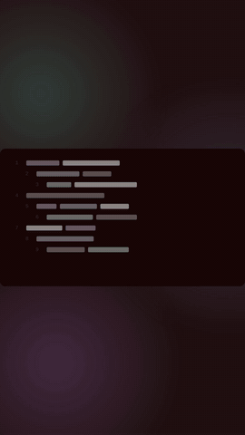<br>`before-after-cut`: hard cut from old to new, with a flash |
| 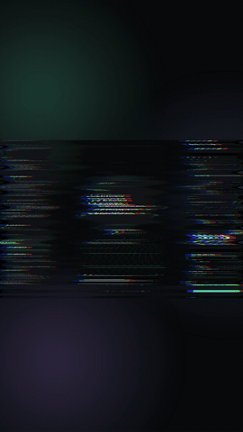<br>`glitch`: bands and split RGB | 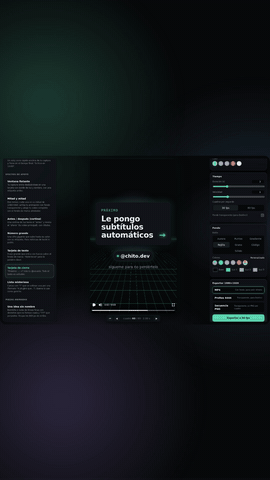<br>`notification`: a phone-style alert slides down | 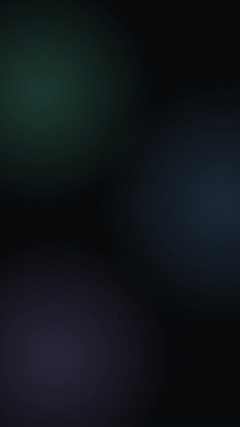<br>`red-strike`: "3 hours" crossed out → "10 min" |
| 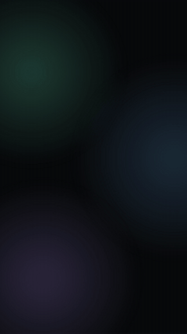<br>`prompt-typing`: a prompt or command types itself | 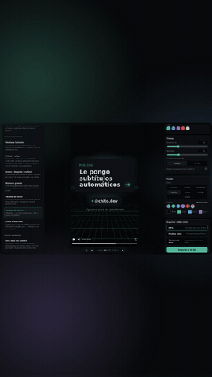<br>`stopwatch`: a clock races and stops at "10:00" | 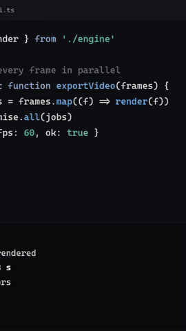<br>`freeze-frame`: "Yep, that's me." Your video freezes and an arrow points at you |
| 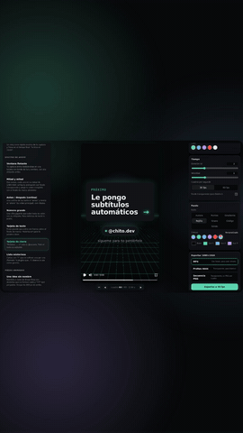<br>`spotlight`: everything goes dark except one detail | 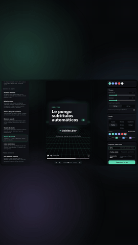<br>`cursor-click`: a cursor clicks and the camera dives in | |

**Over your video:**

| | | |
|---|---|---|
| 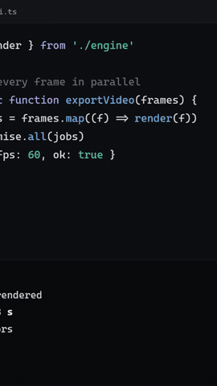<br>`comment-reply`: a viewer's comment pops up, to answer it on camera | 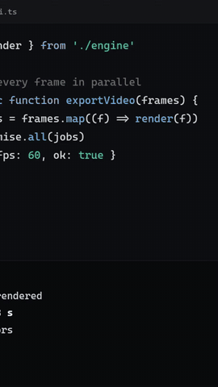<br>`top-list`: "3 tools you need", one by one | 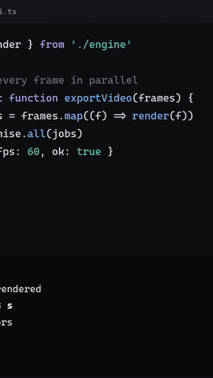<br>`poll`: the bars fill in and the winner lights up |

**Support effects**: `floating-window` (your capture in a card with a label), `split-screen` (two 1080×960 shots),
`before-after-wipe` (a light curtain reveals the "after"), `big-number` (a counting number), `text-card` (a big phrase),
`end-card` ("Next: … →" + your @handle), `mystery-cards` ("?" cards that flip), and `no-effect` (your video as is, for captions only).
**Animated piece**: `nameless-idea` (a thin-line bulb or cloud with sparks and a blinking "???").

## Requirements

- **Node.js 22.18 or newer**: the server runs `server/index.ts` directly with Node's built-in TypeScript support.
- **pnpm** (`npm install -g pnpm`).
- **FFmpeg** with `ffprobe` on your `PATH`. It reads your media, converts ProRes uploads so the browser can play them,
  and extracts audio for captions. The exports themselves use the FFmpeg bundled with Remotion.
- Tested on **Windows 11**. Other systems should work, but the UI fonts are Windows system fonts
  (Segoe UI Variable, Georgia, Cascadia Code), so the effects may look slightly different on another PC.
  The caption fonts (Montserrat and Bangers) ship with the project and look the same everywhere.

## How to use it

1. **Drop** your video, image or audio into the left panel. It's copied to `media/`.
   ProRes (which Chrome can't play) is converted with your FFmpeg; your original file isn't touched.
2. **Click** a hook or effect in the gallery (hover to play it, `/` to search): it's applied instantly. Each one says what it works with (🎬 video, 🖼 image, 🎵 audio,
   ✨ text only); the ones that don't fit what you picked are dimmed, with the reason.
3. Edit texts, colors, duration and speed on the right; the preview updates live.
   - ◀ ▶ under the preview step frame by frame.
   - On effects with a zoom point, "🎯 Pick point" lets you click on the key detail.
   - In texts, words between `*asterisks*` come out in italic serif with the accent color.
   - **Background** picks the animated style (Aurora, Dots, Gradient, Grid, Grain, Code or Solid) and its colors.
4. **Export** at 30 or 60 fps. Files land in `exports/`:
   - **MP4 (H.264)**: always with the background, ready to upload.
   - **ProRes 4444 (.mov)**: transparent background, to layer in DaVinci Resolve or any editor.
   - **PNG sequence**: transparent, one PNG per frame.

The app remembers your last effect, its settings and your transcripts between sessions (in your browser only).
The UI speaks English and Spanish (ES/EN switch in the header; it follows your browser's language at first).
Everything runs on your PC: the server only listens on `127.0.0.1` and your files are never uploaded.

### Apply to my video, or effect only

With a **video** selected, **Time → What do you export?** has two modes:

- **Apply to my video**: the export lasts your whole video and keeps its audio. The effect covers one span: pick where
  with **Starts at** (or drag the span on the bar under the preview) and how long with **Effect duration**.
  Hooks go at the start, cards on top of your video with a dark scrim, and full-length formats like Split screen last the whole video.
- **Effect only**: a short standalone clip, silent, to place in your editor.

With an **image** there's no timeline: the export lasts as long as the effect. With an **audio** file the export lasts
as long as the audio, over the chosen background; only cards, captions and "No effect" apply.

### Auto-captions

Captions are a layer that goes on top of **any** effect.

1. Pick your video or audio **with a voice** and turn on captions in the **Captions** panel.
2. Choose quality (Fast, Good or Best) and language, and press **🎙 Transcribe**. The first time it installs
   Whisper (whisper.cpp) and downloads the model into `.whisper/` (Good ≈ 470 MB, Best ≈ 1.5 GB). After that it runs offline.
3. Fix any word Whisper got wrong (Enter saves; empty deletes; two words split the time).
4. Pick a style:

| Style | Looks like |
|---|---|
| Bold yellow | Thick uppercase (Montserrat) with a black outline; the spoken word turns yellow |
| Comic | Comic lettering (Bangers) in italics; each word pops and the active one glows green |
| Karaoke | The whole phrase visible, with a colored box behind the spoken word |
| Pop | One huge word at a time that bounces |
| Clean | Minimal: what's still to be said is dim, no outline |
| Editorial | Words come in blurred and the active one turns into a colored italic serif |

5. Export the MP4 with the captions burned in, ProRes/PNG with only the captions (use "No effect"), or download **SRT / VTT**.

### Checking transparency in DaVinci Resolve

Put your footage on V1 and the ProRes export (or the PNG folder, which DaVinci reads as one clip) on V2.
If you see black instead of your footage, right-click the clip → *Clip Attributes → Video → Alpha Mode* and try
*Straight*, then *Premultiplied*. You can also check with `ffprobe`: the stream should say `pix_fmt=yuva444p12le`
(the "a" is the alpha channel).

## What it isn't

- **One effect at a time.** You apply one hook or effect (plus captions) per export. Several effects in one video
  (hook at the start, card in the middle, end card) means exporting each and combining them in your editor.
- **Not a video editor.** There's no multi-track timeline, no cutting and no music. It makes the pieces; your editor assembles them.

## Add a new effect

**Quickest: a mod.** `pnpm new-mod "my effect"` creates `mods/my-effect/index.tsx` from a working template; the app
loads it on its own (filter **Mods**). See [the mods guide](docs/mods.md).

**Built into the app:**

1. Create `src/effects/hooks/MyEffect.tsx` (or `src/effects/support/`). Copy a similar one as a starting point.
   Export an `EffectDef` with `id`, `name`, `description`, `defaults`, `params` and `component`.
   Everything an effect needs (animation helpers, palette, building blocks) is in `src/sdk.ts`.
   `name`, `description` and param labels are `{ en, es }`; sample texts go in English in `defaults` and in Spanish
   in `localized.es`.
2. Animate **only** from time: `t = timeOf(useCurrentFrame(), fps, speed)`. No `Date.now()`, `Math.random()`
   or CSS animations: that's what keeps the frame-by-frame render identical to the preview.
3. Register it in `src/registry.ts`. It shows up in the app and in the render.
4. Run `pnpm test` and `pnpm typecheck`.

Want a first contribution? See [good first issues](docs/good-first-issues.md) and [CONTRIBUTING](CONTRIBUTING.md).

## Project structure

```
src/theme.ts            Aurora colors and fonts
src/lib/                pure logic (animation, layout, text, captions, i18n) + tests
src/components/         backgrounds, media, window, animated text, captions layer
src/effects/            hooks/, support/, pieces/ and "No effect"
src/registry.ts         effect list (built-in effects + mods)
src/shell.tsx           shared wrapper: background, your video with audio, effect span and captions
src/sdk.ts              everything an effect or mod needs, from one import
mods/                   your own effects (mods), loaded automatically; sticker-slap/ is the example
src/remotion/           render entry (one composition per effect)
app/                    local app (React + Remotion Player): layout/, panels/, state/ (remembered between sessions)
server/                 local server: uploads, Range serving, Whisper transcription, export with @remotion/renderer
docs/                   mods guide, phone camera hooks guide, why Remotion, good first issues
scripts/                README GIFs rendered with the app itself
```

| Command | What it does |
|---|---|
| `pnpm dev` | opens the app at http://localhost:3210 |
| `pnpm test` | tests for the pure logic (`node --test`) |
| `pnpm typecheck` | type-checks with TypeScript |
| `pnpm new-mod "name"` | creates a new mod in `mods/` from the template |
| `node scripts/readme-media.ts <clip>` | re-renders the README GIFs through the running app |

## Known limits

- **H.264 on the CPU**: Remotion doesn't use AMD GPUs to encode. A 2–3 s export took 5–13 s on the test PC; the first one takes longer while it bundles.
- **Audio**: "Apply to my video" keeps your video's audio; "Effect only" clips are silent.

## License

The code is [MIT](LICENSE). **Remotion has its own license**: it's free for individuals, companies of up to 3 people
and non-profits; bigger for-profit companies need a [Remotion Company License](https://www.remotion.dev/license).
The caption fonts are under the [SIL Open Font License](assets/fonts/OFL.txt).

More: [camera hooks with your phone](docs/phone-hooks.md) · [why Remotion](docs/why-remotion.md)
